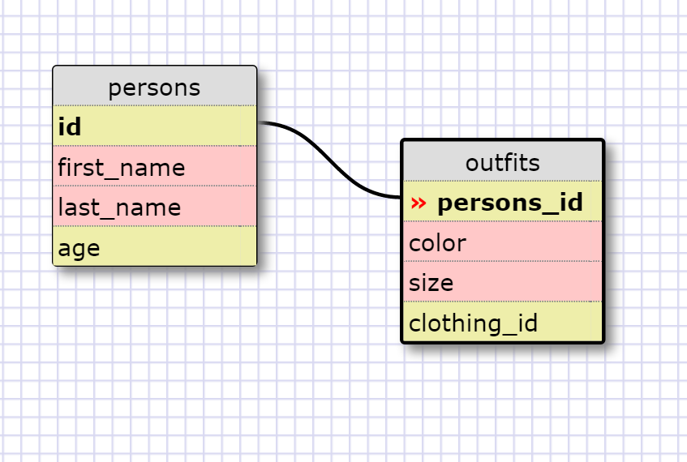

1.
SELECT * FROM states;

2.
SELECT * FROM regions;

3.
SELECT state_name, population FROM states;

4.
SELECT state_name, population FROM states ORDER BY population DESC;

5.
SELECT state_name FROM states WHERE region_id = 7;

6.
SELECT state_name, population_density FROM states ORDER BY population_density ASC;

7.
SELECT states WHERE population BETWEEN 1000000 AND 1500000;

8.
SELECT state_name, region_id FROM states ORDER BY region_id ASC;

9.
SELECT region_name FROM regions WHERE region_name LIKE '%central%';
region_name

10. SELECT regions.region_name, states.state_name FROM regions JOIN states ON regions.id = states.region_id;

Release 7: Reflect
In the reflection section in your my_solution.md file, answer the following questions:

##What are databases for?
Storing lots of data. Hashes / Arrays / Objects work for small abouts of data, but you need a databse struture for lots of data.  It helps with scaling, speed, and having multiple people accessing and changing data at the same time.

##What is a one-to-many relationship?
It describes the relationship between two attributes where one attribute only has one record and the other attribute has many (including the first one).  In this relationship, it makes sense to split them into different tables.

##What is a primary key? What is a foreign key? How can you determine which is which?
How can you select information out of a SQL database? What are some general guidelines for that?
A primary key is the unique attribute in a table. A foreign key is a unique attribute in a table that links it to another table's primary key. You select info from SQL with commands like SELECT table_name FROM info_wanted.  Though not required, a general guideline is to put commands in caps.

